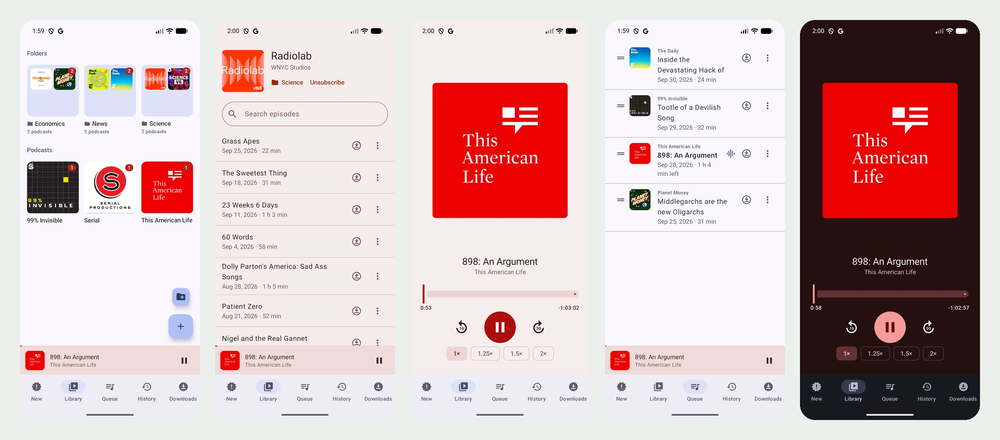

# Tinypod

[](LICENSE)
[](#building-and-installing)
[](#android-auto)

A small, personal podcast app for Android and Android Auto. Subscribe to
RSS feeds, sort shows into folders, keep a queue of what you mean to
finish, download for offline listening, and pick up exactly where you
left off, on the phone or in the car.

No accounts, no server, no analytics: everything lives in a local
database on the phone, and the app only talks to the podcasts' own
feeds (plus Apple's public podcast directory when you search).



## What it does

- **Subscriptions.** Search Apple's podcast directory by name, or paste
  any RSS feed URL. Feeds refresh when you open the app and every four
  hours in the background.
- **New episodes.** The New tab lists episodes newer than the latest one
  you've finished (or than when you subscribed), across all shows. The
  same count shows as a badge on each podcast and folder.
- **Folders.** The library is a grid of artwork tiles; folders show a
  2×2 mosaic of the shows inside. Long-press a tile to move it to a
  folder, unsubscribe, or rename and delete folders.
- **Player.** Mini player plus a full player with scrubber, back 10 s,
  forward 30 s and 1×–2× speed. The player and each podcast's page take
  their colours from the artwork, in light and dark mode, with contrast
  kept readable for any cover.
- **Resume.** The position is saved every few seconds and on every
  pause. After a restart, or when Bluetooth or the car says "play", the
  last episode resumes where it stopped.
- **Queue.** Episodes stay queued until you finish them, so you can
  switch between them freely. Reorder by dragging, or "Move to top/bottom"
  from the menu. When an episode ends the top of the queue plays; with an
  empty queue playback simply stops.
- **History**, grouped by day (Today, Yesterday, weekday, date).
- **Downloads** for offline listening, with a storage overview. The player
  always prefers the downloaded file.
- **Search within a podcast**, matching titles and show notes.
- **Adapts to the screen.** Foldables, tablets and landscape get a side
  rail instead of the bottom bar, and the player fits any window without
  scrolling.

## Android Auto

Tinypod shows up as a media app in Android Auto:

- Four tabs: **New**, **Library** (folders and podcasts as artwork tiles,
  with "N new" under each), **Queue** and **Downloads**. Downloaded
  episodes carry the car's "downloaded" badge, and played / in-progress
  episodes show their progress.
- The player screen has back 10 s, play/pause, forward 30 s and a speed
  button that cycles 1× → 1.25× → 1.5× → 2×.
- **Next and previous** on the steering wheel (or a Bluetooth headset)
  skip forward 30 s and back 10 s, as podcast apps do.
- "Hey Google, play *show* on Tinypod" plays that show's in-progress or
  newest unplayed episode; "play Tinypod" resumes the last one.

Because the app is sideloaded rather than installed from Google Play,
Android Auto hides it until you allow unknown sources once: open Android
Auto's settings, tap the **Version** row ten times to unlock developer
settings, then in the ⋮ menu choose **Developer settings** and enable
**Unknown sources**.

## Building and installing

You need a JDK (17 or newer; Gradle fetches the exact toolchain it wants)
and the Android SDK with API level 37 (`sdk.dir` in `local.properties`,
or `ANDROID_HOME`). Then:

```bash
./gradlew assembleDebug
```

The APK ends up in `app/build/outputs/apk/debug/app-debug.apk`. Install
it with `adb install -r app-debug.apk`, or copy it to the phone and open
it there (Android asks once to allow installing from that app). The app
needs Android 14 or newer.

### Keep one signing key

Android only installs a new build over an existing one if both are
signed with the same key; a different key means uninstalling first, and
losing subscriptions, progress and downloads. If there's a keystore at
`keystore/debug.keystore` the build signs with it, so keep that file
(and a backup) and every build installs as an update. Without it, builds
use the SDK's default debug key from `~/.android/debug.keystore`, which
works just as well as long as you always build on the same machine. The
`keystore/` folder is git-ignored: your signing key is yours alone.

## How it works

- **Kotlin and Jetpack Compose**, with a Room database (podcasts,
  episodes, folders, queue) as the single source of truth; every screen
  observes it, so changes from the player, a feed refresh or a download
  show up everywhere at once.
- **Feeds** are fetched with plain `HttpURLConnection` and parsed with
  Android's `XmlPullParser` (a small hand-rolled parser that handles the
  usual `itunes:` tags, odd date formats and `HH:MM:SS` durations).
  Refreshes keep each episode's playback state.
- **Playback** is a Media3 `MediaLibraryService` around ExoPlayer, which
  gives background playback, the notification and lock-screen controls,
  Bluetooth resume and the Android Auto browse tree in one place. The
  player's real duration replaces the feed's (which is often short,
  e.g. with inserted ads).
- **Downloads** go through the system `DownloadManager` into the app's
  own storage, so they carry on in the background and need no
  permissions. Podcast audio URLs often chain several tracking redirects,
  more than `DownloadManager` accepts, so the app resolves them first.
- **Artwork colours** come from `androidx.palette`: one colour is picked
  from each cover and turned into a light and a dark colour scheme whose
  text and buttons meet WCAG contrast for any hue.

## Privacy

Tinypod has no account, no backend and no analytics. The network
requests it makes are: the feeds you subscribe to, the audio and artwork
those feeds link to, and Apple's iTunes Search API when you search for a
podcast by name. Everything else (subscriptions, progress, queue,
history, downloads) stays on the phone.

## Development

```bash
./gradlew testDebugUnitTest           # unit tests (JVM)
./gradlew connectedDebugAndroidTest   # instrumented tests on a device or emulator
```

The instrumented tests use in-memory databases, but note that
`connectedDebugAndroidTest` uninstalls the app when it's done, which
wipes its data on that device. To keep your data, build the test APK
with `./gradlew assembleDebugAndroidTest`, install it with
`adb install -r -t app/build/outputs/apk/androidTest/debug/app-debug-androidTest.apk`,
and run `adb shell am instrument -w app.tinypod.test/androidx.test.runner.AndroidJUnitRunner`.

Code layout, under `app/src/main/java/app/tinypod/`:

| Package   | What's in it                                                          |
|-----------|-----------------------------------------------------------------------|
| `data`    | Room entities and DAOs, subscriptions, downloads, queue and folder actions |
| `feed`    | HTTP, RSS parsing, podcast search, background refresh                 |
| `player`  | Playback service, Android Auto browse tree, artwork provider          |
| `ui`      | Compose screens                                                        |
| `theme`   | App theme and the artwork-based colour schemes                        |

The launcher icon is generated by `tools/launcher_icon.py`, which also
holds the other colour variants; see the comment at its top.

## License

[MIT](LICENSE)
